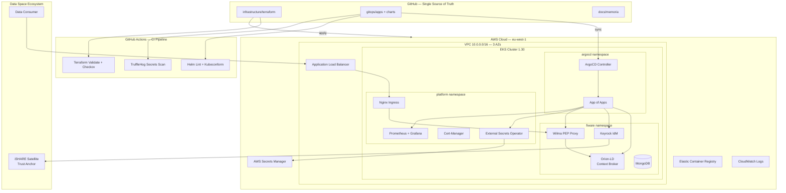
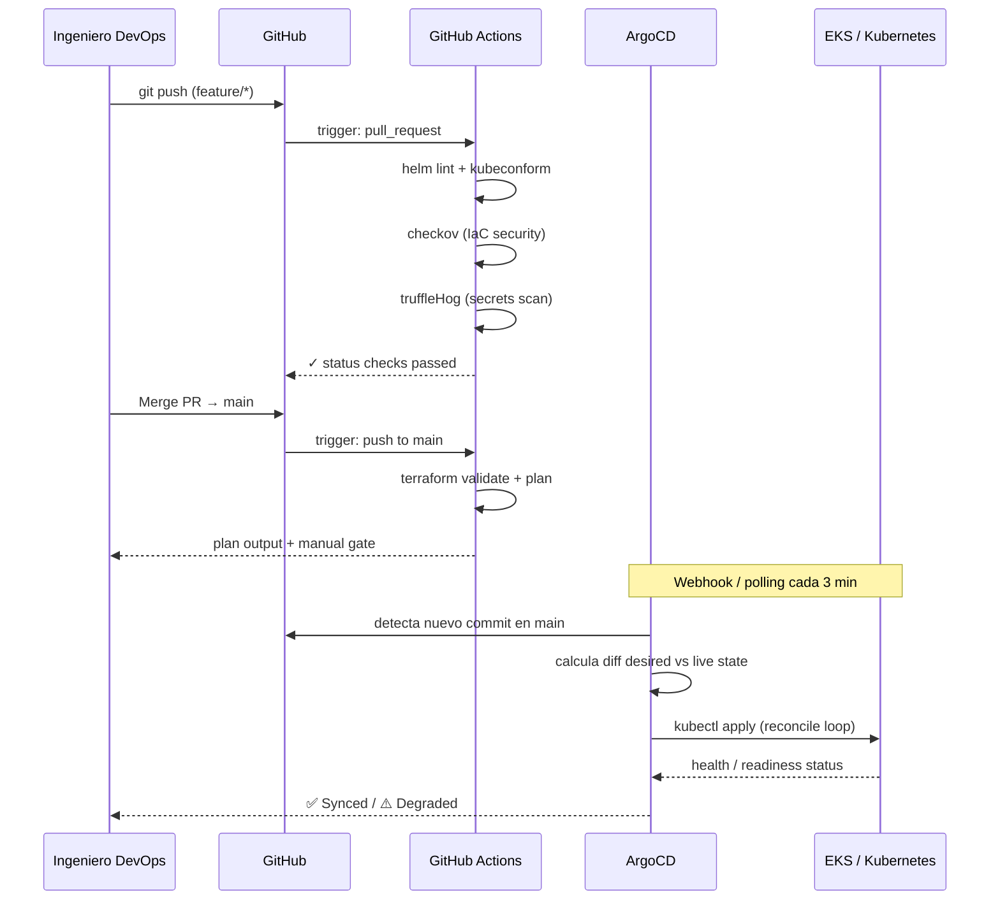
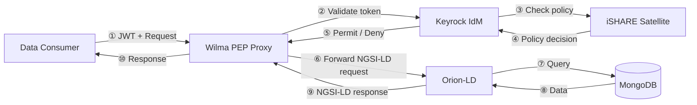

# TFM — Plataforma GitOps para Data Spaces basada en FIWARE sobre AWS

> **Trabajo Fin de Máster** — Máster Universitario en DevOps y Cloud  
> **Universidad Internacional de La Rioja (UNIR)** — Curso 2025-2026  
> **Autor:** Jesús Monsalve  
> **Fecha de entrega:** 6 de mayo de 2026

[](https://github.com/jdmonsalvel/tfm-fiware-gitops/actions/workflows/terraform-validate.yml)
[](https://github.com/jdmonsalvel/tfm-fiware-gitops/actions/workflows/gitops-validate.yml)
[](https://github.com/jdmonsalvel/tfm-fiware-gitops/actions/workflows/security-scan.yml)

---

## Descripción

Este repositorio contiene el artefacto técnico del TFM, que propone y valida un **modelo de referencia arquitectónico** para el despliegue automatizado, reproducible y auditable de una plataforma de **Data Space** basada en componentes FIWARE sobre infraestructura AWS, siguiendo el paradigma **GitOps** mediante ArgoCD y Helm.

La solución integra:
- **Orion-LD** como Context Broker NGSI-LD (ETSI GS CIM 009)
- **Keyrock** como Identity Manager con soporte OAuth2/OpenID Connect e iSHARE
- **Wilma** como PEP Proxy para aplicación de políticas de acceso (XACML)
- **iSHARE/DSBA** como marco de confianza interoperable para Data Spaces europeos
- **ArgoCD** como operador GitOps para sincronización continua declarativa
- **Terraform** para aprovisionamiento de infraestructura como código (IaC)
- **External Secrets Operator** + AWS Secrets Manager para gestión segura de secretos
- **GitHub Actions** para pipelines CI con validación, escaneo de seguridad y gates de aprobación

---

## Arquitectura Global del Sistema



---

## Flujo GitOps



---

## Flujo de Acceso en el Data Space



---

## Estructura del Repositorio

```
tfm-fiware-gitops/
├── docs/
│   ├── memoria/          # Capítulos TFM — Markdown (→ LaTeX UNIR)
│   └── diagrams/         # Todos los diagramas Mermaid + guía exportación
├── infrastructure/
│   └── terraform/        # IaC: VPC, EKS, IAM, Secrets Manager
│       └── modules/
│           ├── vpc/
│           └── eks/
├── gitops/
│   ├── bootstrap/        # ArgoCD install + App of Apps root
│   ├── apps/             # ArgoCD Application CRDs
│   └── charts/           # Helm charts FIWARE personalizados
│       ├── orion-ld/
│       ├── keyrock/
│       └── wilma/
├── scripts/              # bootstrap.sh + teardown.sh
└── .github/workflows/    # CI/CD pipelines
```

---

## Cronograma de Implementación

| Fase | Período | Entregables |
|------|---------|-------------|
| 1 — Infraestructura | 20–25 Abr 2026 | VPC + EKS funcional via Terraform |
| 2 — GitOps Bootstrap | 26–28 Abr 2026 | ArgoCD operativo + App of Apps |
| 3 — FIWARE Stack | 29 Abr – 2 May 2026 | Orion-LD + Keyrock + Wilma desplegados |
| 4 — Integración Data Space | 3–4 May 2026 | Flujo E2E con iSHARE |
| 5 — Validación y evidencias | 5 May 2026 | Capturas, métricas, pruebas |
| 6 — Entrega final | 6 May 2026 | Demo + memoria LaTeX |

---

## Coste Estimado AWS

| Servicio | Tipo | Coste/día (est.) |
|---------|------|------------------|
| EKS Control Plane | Managed | ~$2.40 |
| EC2 Worker Nodes (2× t3.medium) | On-Demand | ~$4.80 |
| NAT Gateway | Managed | ~$1.08 |
| Application Load Balancer | Managed | ~$0.70 |
| Secrets Manager | Per secret | ~$0.12 |
| **Total estimado** | | **~$9–16/día** |

> Destruir el entorno con `scripts/teardown.sh` cuando no se use para minimizar costes.

---

## Licencia

MIT License — © 2026 Jesús Monsalve
