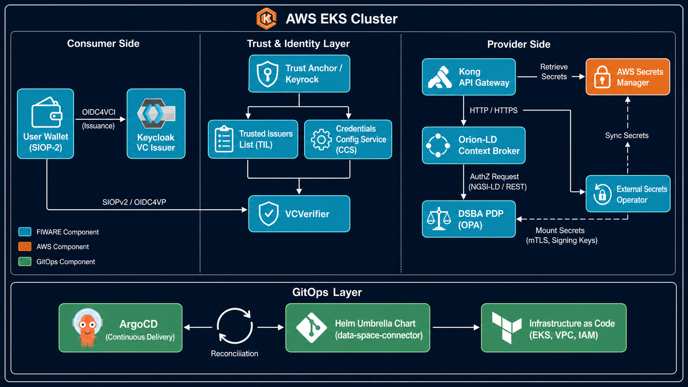
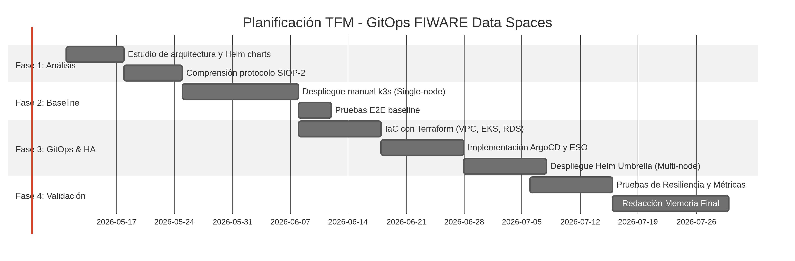

# TRABAJO FIN DE MÁSTER
**Máster Universitario en Desarrollo y Operaciones (DevOps)**
**Universidad Internacional de La Rioja (UNIR)**

---

**Título**: Automatización GitOps de FIWARE Data Spaces con ArgoCD y Helm en entornos multi-nodo sobre Amazon Web Services

**Autor**: Jesús David Monsalve Lezama

**Director**: Rafael Merlo Loranca

**Fecha de entrega**: Mayo 2026

**Tipo de trabajo**: Tipo 1 — Desarrollo Práctico

---

> **ENTREGA 1 — BORRADOR INICIAL**
> Documento presentado para revisión del director en la semana 7 del cuatrimestre 2.
> Contiene: Abstract, Introducción, Estado del Arte (borrador), Metodología y boceto del Desarrollo.
> Capítulos de Resultados y Conclusiones se incorporarán en el Borrador Intermedio (semana 11).

---

**ÍNDICE**

1. [Resumen / Abstract](#resumen)
   - 1.1 Resumen
   - 1.2 Abstract (English)
2. [Introducción](#introducción)
   - 2.1 Motivación y contexto
   - 2.2 Planteamiento del problema
   - 2.3 Objetivos
   - 2.4 Estructura del documento
   - 2.5 Alcance y limitaciones
3. [Contexto y Estado del Arte](#estado-del-arte)
   - 3.1 FIWARE y los Data Spaces europeos
   - 3.2 GitOps: principios y evolución
   - 3.3 Kubernetes y Amazon EKS
   - 3.4 Seguridad en despliegues cloud-native
     - 3.4.1 Principios de seguridad implementados
     - 3.4.2 Análisis de modelo de amenazas (threat modeling)
     - 3.4.3 Cumplimiento y hardening
   - 3.5 Trabajos relacionados
     - 3.5.1 Despliegues FIWARE existentes
     - 3.5.2 GitOps en entornos de investigación y producción
     - 3.5.3 Data Spaces en producción: el ecosistema Gaia-X e IDSA
     - 3.5.4 Comparativa de implementaciones
   - 3.6 Análisis comparativo de herramientas GitOps
4. [Metodología](#metodología)
   - 4.1 Enfoque metodológico
   - 4.2 Fases de desarrollo
   - 4.3 Principios de diseño
   - 4.4 Arquitectura de referencia en AWS
   - 4.5 Métricas de evaluación
   - 4.6 Gestión de riesgos
5. [Boceto del Desarrollo](#desarrollo)
   - 5.1 Plataforma de despliegue: Amazon Web Services
   - 5.2 Análisis del FIWARE Data Space Connector
6. [Bibliografía](#bibliografía)
   - 6.1 Estándares y regulación
   - 6.2 GitOps y herramientas
   - 6.3 Kubernetes, Helm y AWS
   - 6.4 FIWARE
   - 6.5 Artículos académicos

---

## 1. Resumen / Abstract {#resumen}

### 1.1 Resumen

El presente Trabajo Fin de Máster aborda el diseño e implementación de una arquitectura GitOps para el despliegue automatizado y verificado de **FIWARE Data Spaces** en clústeres Kubernetes multi-nodo sobre Amazon Web Services (AWS). El trabajo responde a la necesidad creciente de infraestructuras de datos soberanas, interoperables y declarativamente gestionadas en el marco de la Estrategia Europea de Datos y la iniciativa Gaia-X.

La solución desarrollada utiliza **ArgoCD** como motor de reconciliación GitOps y el **Helm Umbrella oficial de FIWARE** (`data-space-connector`) como descriptor declarativo de la aplicación, integrando los componentes Trust Anchor (Keyrock), Trusted Issuers List, Credentials Config Service, Orion-LD y Kong en un despliegue coordinado sobre Amazon EKS. La infraestructura se aprovisiona de forma declarativa mediante **Terraform**, y los secretos se gestionan sin presencia en el repositorio mediante el **External Secrets Operator** integrado con AWS Secrets Manager.

El trabajo sigue una metodología iterativa en cuatro fases: análisis de la arquitectura FIWARE, despliegue baseline manual en single-node (k3s), automatización GitOps en multi-nodo, y validación mediante pruebas E2E automatizadas. Se valida el flujo de autenticación completo Consumer → Trust Anchor → Connector → Provider Service y se documentan métricas de alta disponibilidad incluyendo tolerancia a fallo de nodo y tiempo de sincronización de ArgoCD.

Como resultado, se obtiene el primer pipeline GitOps completo, documentado y reproducible para FIWARE Data Spaces, con valor práctico para organizaciones como ITA Aragón y valor académico como referencia para la comunidad DevOps/FIWARE.

**Palabras clave**: GitOps, FIWARE, Data Spaces, ArgoCD, Kubernetes, Helm, AWS EKS, Gaia-X, EU Data Spaces, DevOps

---

### 1.2 Abstract (English)

This Master's Thesis addresses the design and implementation of a GitOps architecture for the automated and verified deployment of **FIWARE Data Spaces** in multi-node Kubernetes clusters on Amazon Web Services (AWS). The work responds to the growing need for sovereign, interoperable, and declaratively managed data infrastructures within the framework of the European Data Strategy and the Gaia-X initiative.

The developed solution uses **ArgoCD** as the GitOps reconciliation engine and the **official FIWARE Helm Umbrella** (`data-space-connector`) as the declarative application descriptor, integrating the Trust Anchor (Keyrock), Trusted Issuers List, Credentials Config Service, Orion-LD, and Kong components in a coordinated deployment on Amazon EKS. Infrastructure is provisioned declaratively via **Terraform**, and secrets are managed without repository presence using the **External Secrets Operator** integrated with AWS Secrets Manager.

The work follows an iterative four-phase methodology: FIWARE architecture analysis, manual baseline deployment on single-node (k3s), GitOps automation on multi-node, and validation through automated E2E tests. The complete authentication flow Consumer → Trust Anchor → Connector → Provider Service is validated, and high-availability metrics are documented, including node failure tolerance and ArgoCD synchronization time.

As a result, the first complete, documented, and reproducible GitOps pipeline for FIWARE Data Spaces is produced, with practical value for organizations such as ITA Aragón and academic value as a reference for the DevOps/FIWARE community.

**Keywords**: GitOps, FIWARE, Data Spaces, ArgoCD, Kubernetes, Helm, AWS EKS, Gaia-X, EU Data Spaces, DevOps

---

## 2. Introducción {#introducción}

### 2.1 Motivación y contexto

La economía de datos europea atraviesa un momento de transformación estructural impulsado por iniciativas regulatorias como la **Estrategia Europea de Datos** (European Data Strategy, 2020) y su concreción en el **Data Governance Act** (Reglamento UE 2022/868) y el **Data Act** (Reglamento UE 2023/2854). Estos instrumentos normativos exigen infraestructuras de intercambio de datos soberanas, interoperables y gobernadas, creando un imperativo técnico y organizativo de primer orden para organizaciones de toda Europa.

En este contexto, **FIWARE** emerge como la plataforma de referencia open source para la creación de *data spaces* que permiten el intercambio seguro y controlado de datos entre organizaciones, cumpliendo los principios de soberanía digital definidos por la iniciativa **Gaia-X**. Con más de 700 organizaciones adheridas a la FIWARE Foundation y su adopción en proyectos estratégicos de *smart cities*, agricultura de precisión e infraestructuras industriales, FIWARE se ha consolidado como el substrato tecnológico preferente para la implementación de data spaces interoperables en el ecosistema europeo.

Sin embargo, la adopción operativa de FIWARE Data Spaces en entornos de producción presenta una brecha significativa: el despliegue actual de sus componentes —incluyendo el *Trust Anchor*, el *Connector*, y los servicios de consumidor y proveedor— se realiza de forma mayoritariamente manual o mediante invocaciones directas al CLI de Helm. Esta aproximación introduce riesgos de deriva de configuración (*configuration drift*), dificulta la reproducibilidad entre entornos y limita la escalabilidad horizontal a clústeres Kubernetes multi-nodo.

La práctica **GitOps**, cuyo principio fundamental es tratar el repositorio Git como la única fuente de verdad (*single source of truth*) del estado deseado de la infraestructura, ofrece una solución elegante a estas limitaciones. Formalizada por el OpenGitOps Working Group de la Cloud Native Computing Foundation (CNCF) en 2022, GitOps establece cuatro principios irrenunciables: declaratividad del estado, inmutabilidad y versionado, extracción automática por agentes software (*pull model*) y reconciliación continua. Mediante herramientas como **ArgoCD**, es posible establecer un bucle de reconciliación continua que detecta cualquier divergencia entre el estado declarado en Git y el estado real del clúster, aplicando las correcciones de forma automática.

El presente Trabajo Fin de Máster (TFM) propone desarrollar una solución *end-to-end* que automatice mediante GitOps el despliegue del **FIWARE Data Space Connector** —el Helm Umbrella oficial de FIWARE— sobre clústeres Kubernetes multi-nodo, garantizando alta disponibilidad, reproducibilidad total y verificación automática del flujo E2E completo.

### 2.2 Planteamiento del problema

El problema central que aborda este trabajo puede enunciarse en los siguientes términos:

> *No existe un flujo GitOps completo, documentado y reproducible para desplegar de forma automatizada un dataspace FIWARE completo (Consumer, Provider, Connector, Trust Anchor) en clústeres Kubernetes multi-nodo, lo que impide a organizaciones como ITA Aragón o entidades académicas adoptar FIWARE Data Spaces con garantías operativas en producción.*

Esta carencia se manifiesta en tres dimensiones:

**Dimensión técnica**: La ausencia de un pipeline GitOps implica que cualquier cambio en la configuración requiere intervención manual, aumentando el tiempo de despliegue (*deployment lead time*) y la probabilidad de errores humanos. Sin reconciliación automática, la detección y corrección de *configuration drift* depende del conocimiento tácito del equipo, lo cual es incompatible con los requisitos de alta disponibilidad de entornos productivos.

**Dimensión operativa**: Los datos gestionados bajo el EU Data Governance Act están sujetos a requisitos de trazabilidad y auditoría que un modelo de despliegue manual no puede satisfacer de forma sistemática. La ausencia de un historial de cambios verificable en la configuración del clúster representa un riesgo de cumplimiento normativo para las organizaciones que adoptan FIWARE en sectores regulados.

**Dimensión académica y comunitaria**: La falta de una referencia GitOps para FIWARE Data Spaces supone un obstáculo para la comunidad investigadora y para proyectos de smart cities, industria 4.0 e IoT que deseen adoptar esta tecnología con prácticas DevOps maduras. El análisis del repositorio oficial `FIWARE/data-space-connector` y de la literatura técnica disponible confirma que no existe actualmente ninguna implementación de referencia de este tipo.

### 2.3 Objetivos

#### 2.3.1 Objetivo general

Diseñar e implementar una arquitectura GitOps para el despliegue automatizado y verificado de FIWARE Data Spaces en Kubernetes multi-nodo, utilizando ArgoCD como motor de reconciliación y el Helm Umbrella oficial de FIWARE como descriptor declarativo de la aplicación.

#### 2.3.2 Objetivos específicos

| ID | Objetivo |
|----|----------|
| OE-1 | Analizar la arquitectura del FIWARE Data Space Connector e identificar los puntos de extensión para GitOps y las dependencias de arranque entre componentes. |
| OE-2 | Implementar un despliegue baseline documentado con Helm directo en clúster Kubernetes single-node como línea de referencia medible. |
| OE-3 | Aprovisionar infraestructura cloud (VPC + clúster Kubernetes multi-AZ) de forma declarativa con Terraform siguiendo el principio de infraestructura inmutable. |
| OE-4 | Diseñar e implementar un pipeline ArgoCD con patrón App of Apps que despliegue el dataspace FIWARE completo en clúster multi-nodo con Sync Waves. |
| OE-5 | Validar el flujo E2E: Consumer → autenticación Trust Anchor → Connector → Provider Service, mediante pruebas automatizadas con bash + curl + jq. |
| OE-6 | Medir métricas de alta disponibilidad: tiempo de sincronización ArgoCD, tolerancia a fallo de nodo y detección de configuration drift. |
| OE-7 | Producir una referencia GitOps replicable para la comunidad FIWARE con repositorio público documentado. |

### 2.4 Estructura del documento

El presente TFM se organiza en los siguientes capítulos. Los capítulos 1 y 2 son preliminares (resumen e introducción). Los capítulos 3 al 6 constituyen el cuerpo del borrador inicial; los capítulos 7 a 9 se completarán en el borrador intermedio y en la versión final:

| Cap. | Título | Estado en este borrador |
|------|--------|------------------------|
| 1 | Resumen / Abstract | Completo |
| 2 | Introducción | Completo |
| 3 | Contexto y Estado del Arte | Borrador (requiere expansión en §3.4 y §3.5) |
| 4 | Metodología | Completo |
| 5 | Boceto del Desarrollo | Boceto (§5.1 y §5.2 únicamente) |
| 6 | Bibliografía | Parcial |
| 7 | Desarrollo de la Contribución | Pendiente — borrador intermedio |
| 8 | Resultados | Pendiente — borrador final |
| 9 | Conclusiones y Trabajo Futuro | Pendiente — borrador final |

### 2.5 Alcance y limitaciones

El alcance de este trabajo abarca el despliegue automatizado del FIWARE Data Space Connector en infraestructura cloud usando Kubernetes, la configuración de ArgoCD como operador GitOps, y la validación del flujo de autenticación E2E. La implementación de referencia se realiza en AWS EKS (arquitectura de producción) y en k3s multi-nodo (baseline reproducible).

Quedan fuera del alcance del presente trabajo: la implementación de Chaos Engineering avanzado con herramientas especializadas (Chaos Mesh, Litmus), la integración con sistemas legacy externos a FIWARE, la configuración de redes privadas corporativas (VPN/Direct Connect), y la certificación formal de conformidad con el Gaia-X Trust Framework.

---

## 3. Contexto y Estado del Arte {#estado-del-arte}

### 3.1 FIWARE y los Data Spaces europeos

#### 3.1.1 La plataforma FIWARE

FIWARE es una iniciativa promovida por la Unión Europea y soportada por la FIWARE Foundation que proporciona un conjunto de APIs abiertas y componentes de software para la construcción de soluciones de *smart cities*, IoT e intercambio de datos. Su componente central es **Orion-LD**, un *context broker* que implementa la especificación **NGSI-LD** (Next Generation Service Interface — Linked Data) del ETSI (European Telecommunications Standards Institute), permitiendo la gestión y el intercambio de información contextual de forma estandarizada.

La arquitectura de FIWARE se articula en torno a dos conceptos fundamentales: el **Context Broker** como componente de almacenamiento y distribución de información contextual en tiempo real, y el **Marketplace de componentes** de la FIWARE Foundation, que cataloga más de 40 *Generic Enablers* (GEs) certificados para funciones específicas como gestión de identidades, procesamiento de datos, IoT y seguridad.

La plataforma FIWARE ha evolucionado desde su origen como proyecto de infraestructura para smart cities hacia convertirse en el substrato tecnológico preferente para la implementación de *data spaces* interoperables en el marco regulatorio europeo. Esta evolución se materializa en el **FIWARE Data Space Connector**, publicado en 2023, que implementa la arquitectura de referencia del DSBA (Data Spaces Business Alliance) adaptando los componentes FIWARE existentes.

#### 3.1.2 EU Data Spaces y Gaia-X

La **Estrategia Europea de Datos** (European Data Strategy, 2020) y su materialización en el **Data Governance Act** (Reglamento UE 2022/868) y el **Data Act** (Reglamento UE 2023/2854) establecen el marco legal para la creación de espacios comunes de datos (*data spaces*) en sectores estratégicos como salud, energía, agricultura y transporte.

El Data Governance Act regula las condiciones para la reutilización de datos del sector público, los servicios de intermediación de datos y el altruismo de datos, estableciendo requisitos de neutralidad, transparencia y acceso no discriminatorio. El Data Act complementa este marco extendiendo los derechos de acceso a datos generados por productos conectados (IoT), con implicaciones directas para los data spaces industriales que FIWARE está llamado a soportar.

**Gaia-X** es la iniciativa federada europea para una infraestructura de datos soberana que complementa el marco regulatorio definiendo las reglas de confianza (*Trust Framework*) para los participantes de un data space. El Trust Framework de Gaia-X define los conceptos de *Participant*, *Service Offering*, *Resource* y *Data Exchange* como unidades atómicas del ecosistema, y establece los mecanismos de verificación de conformidad mediante *Verifiable Credentials* (VCs) bajo el estándar W3C DID (Decentralized Identifiers).

FIWARE actúa como implementación de referencia compatible con Gaia-X, proporcionando los componentes necesarios para los roles de Consumer, Provider, Trust Anchor y Connector dentro de un data space conforme al Trust Framework.

#### 3.1.3 FIWARE Data Space Connector

El **FIWARE Data Space Connector** (repositorio oficial: `FIWARE/data-space-connector`) es el Helm Umbrella que empaqueta todos los componentes necesarios para desplegar un dataspace FIWARE completo. Implementa el modelo de referencia DSBA para el intercambio de datos basado en Verifiable Credentials y el protocolo SIOP-2/OIDC4VP.

| Componente | Función | Tecnología base |
|-----------|---------|----------------|
| **Trust Anchor (Keyrock)** | Gestión de identidades y emisión de credenciales verificables | Keyrock Identity Manager |
| **Trusted Issuers List** | Registro de entidades emisoras confiables | API REST + MySQL |
| **Credentials Config Service** | Configuración de esquemas de credenciales | Microservicio Go |
| **Data Space Connector Core (Orion-LD)** | Context broker NGSI-LD | Orion-LD |
| **Kong API Gateway** | PEP Proxy y gestión de APIs | Kong + plugins FIWARE |

El Helm Umbrella (`fiware/data-space-connector`, versión 7.x) permite desplegar estos componentes de forma coordinada, gestionando las dependencias entre charts y la configuración de red interna del clúster Kubernetes.



### 3.2 GitOps: principios y evolución

#### 3.2.1 Origen y definición

El término **GitOps** fue acuñado por Alexis Richardson (CEO de Weaveworks) en un artículo publicado en 2017 bajo el título "GitOps: Operations by Pull Request", donde describía el modelo operativo adoptado internamente en Weaveworks para gestionar sus despliegues en Kubernetes. La esencia del modelo era radical en su simplicidad: si el repositorio Git contiene el estado deseado del sistema, entonces cualquier operación sobre el sistema se convierte en una operación sobre el repositorio.

Los cuatro principios fundamentales de GitOps, formalizados por la **OpenGitOps** specification del CNCF GitOps Working Group (v1.0, 2022), son:

1. **Declarativo**: El estado deseado del sistema se expresa de forma declarativa, no mediante scripts imperativos.
2. **Versionado e inmutable**: El estado deseado se almacena en un sistema de control de versiones que preserva la historia completa y permite auditoría.
3. **Extraído automáticamente** (*pulled automatically*): Los agentes de software extraen automáticamente las declaraciones de estado desde la fuente, sin que el sistema CI necesite acceso directo al clúster.
4. **Reconciliado continuamente**: Los agentes verifican y corrigen de forma continua cualquier divergencia entre el estado declarado y el estado observado.

Estos principios tienen implicaciones directas en la seguridad del sistema: el modelo Pull elimina la necesidad de exponer credenciales del clúster en el sistema de CI, reduciendo significativamente la superficie de ataque en comparación con los modelos Push tradicionales (Jenkins, GitLab CI directo).

#### 3.2.2 Modelos Push vs. Pull

Existen dos paradigmas principales de despliegue en entornos de integración continua:

**Modelo Push (CI-driven)**: El pipeline de CI/CD (e.g., Jenkins, GitLab CI, GitHub Actions) tiene acceso directo al clúster Kubernetes y ejecuta `kubectl apply` o `helm upgrade` al detectar cambios. Este modelo introduce un vector de ataque al requerir credenciales del clúster (kubeconfig o ServiceAccount token) en el sistema CI, que es externo al clúster y potencialmente accesible desde múltiples entornos.

**Modelo Pull (GitOps)**: Un operador instalado dentro del propio clúster (e.g., ArgoCD, Flux) monitoriza el repositorio Git y reconcilia el estado del clúster con el estado declarado. Este modelo minimiza la superficie de ataque y se alinea con el principio de *least privilege*: el clúster decide cuándo aplicar cambios, en lugar de ser controlado externamente.

El presente TFM adopta el modelo Pull mediante ArgoCD, por ser el enfoque recomendado por la CNCF para entornos de producción con requisitos de seguridad y auditoría.

#### 3.2.3 ArgoCD

**ArgoCD** es un controlador GitOps declarativo para Kubernetes, desarrollado originalmente por Intuit y donado a la CNCF, donde alcanzó el nivel *Graduated* en 2022. Con más de 14.000 estrellas en GitHub y adopción documentada en empresas como Adobe, IBM y Tesla, ArgoCD se ha consolidado como el estándar de facto para GitOps empresarial en entornos Kubernetes.

Sus características principales relevantes para este trabajo son:

- **Application CRD**: Define el origen Git (repo, path, revision) y el destino (clúster, namespace) de una aplicación, permitiendo su gestión declarativa.
- **Sync Waves**: Control del orden de despliegue de recursos mediante la anotación `argocd.argoproj.io/sync-wave`. Esencial para gestionar dependencias de arranque entre componentes FIWARE.
- **App of Apps pattern**: Una Application raíz gestiona el ciclo de vida de todas las demás Applications del clúster, permitiendo bootstrapping declarativo completo.
- **Multi-source Applications**: Permite separar el chart Helm (OCI registry) de los values (repositorio Git), manteniendo los valores de configuración bajo control de versiones.
- **Health Assessment**: Evaluación del estado de recursos Kubernetes estándar y custom (CRDs), con criterios configurables por tipo de recurso.
- **RBAC nativo**: Integración con OIDC para control de acceso granular al dashboard y la API de ArgoCD.

#### 3.2.4 Helm como gestor de paquetes Kubernetes

**Helm** es el gestor de paquetes estándar de Kubernetes, que permite parametrizar y versionar manifiestos mediante plantillas Go. En el contexto de GitOps con ArgoCD, Helm se utiliza de dos formas complementarias:

1. **ArgoCD como renderizador Helm**: ArgoCD puede renderizar charts Helm directamente, aplicando valores (`values.yaml`) almacenados en Git sin necesidad de ejecutar `helm install` manualmente.
2. **Umbrella Charts**: Un chart Helm puede declarar dependencias sobre otros charts (sub-charts), creando una unidad de despliegue compuesta. El FIWARE Data Space Connector utiliza este patrón para agregar todos sus componentes en un único chart raíz.

La versión 3.14 de Helm, utilizada en este trabajo, introduce soporte mejorado para repositorios OCI y mejoras en el manejo de dependencias en umbrella charts.

### 3.3 Kubernetes y Amazon EKS

#### 3.3.1 Kubernetes como plataforma de orquestación

**Kubernetes** (k8s) es el sistema de orquestación de contenedores de código abierto desarrollado originalmente por Google y donado a la CNCF en 2016. Su modelo declarativo, basado en el concepto de *desired state*, es la base sobre la que GitOps construye su propuesta de valor: Kubernetes ya implementa internamente un bucle de reconciliación continua (los *controllers*), y GitOps extiende este principio al plano de la configuración y el despliegue.

Los recursos relevantes de Kubernetes para este trabajo son:

- **Deployment**: Gestiona el ciclo de vida de pods sin estado (stateless), con capacidades de rolling update y rollback automático.
- **StatefulSet**: Para componentes con estado persistente como las bases de datos de Keyrock y Orion-LD.
- **Service y Ingress**: Abstracción de red para exposición de servicios dentro y fuera del clúster.
- **NetworkPolicy**: Aislamiento de red entre namespaces, crítico para la separación entre Trust Anchor y Provider en el data space.
- **PersistentVolumeClaim**: Abstracción de almacenamiento persistente para datos stateful de FIWARE.

#### 3.3.2 Amazon EKS

**Amazon Elastic Kubernetes Service (EKS)** es el servicio gestionado de Kubernetes de AWS. Para este TFM, EKS proporciona:

- **Control Plane gestionado**: AWS gestiona la alta disponibilidad del control plane (etcd, API server, scheduler, controller-manager) sin coste operativo adicional para el usuario.
- **Integración con IAM mediante IRSA**: *IAM Roles for Service Accounts* (IRSA) permite asignar permisos AWS a pods individuales mediante OIDC Federation, sin necesidad de credenciales estáticas en el código.
- **EBS/EFS como PersistentVolumes**: Almacenamiento persistente gestionado por AWS para los componentes stateful de FIWARE.
- **AWS Load Balancer Controller**: Provisionamiento automático de Network Load Balancers (NLB) para exposición de servicios, integrado con Route 53 y ACM para TLS.
- **Managed Node Groups**: Gestión automática del ciclo de vida de los nodos worker, incluyendo actualizaciones de AMI y escalado automático.

### 3.4 Seguridad en despliegues cloud-native

La seguridad en la arquitectura de FIWARE Data Spaces sobre AWS se fundamenta en el modelo de **Defensa en Profundidad (DiP)** y los principios de seguridad nativa de la nube (Cloud-Native Security). El diseño garantiza la soberanía del dato y la integridad de la infraestructura mediante la implementación de controles técnicos alineados con estándares internacionales.

#### 3.4.1 Principios de seguridad implementados

1.  **Gestión de Identidades y Acceso (IAM) mediante IRSA:**
    Se utiliza **IAM Roles for Service Accounts (IRSA)** para eliminar el uso de credenciales estáticas dentro del clúster. Cada componente de FIWARE (Keyrock, Orion-LD, etc.) tiene asignado un rol de IAM específico vinculado a su *ServiceAccount* de Kubernetes mediante el proveedor OIDC de EKS.
    * **Beneficio:** Si un pod es comprometido, el atacante no obtiene acceso a los nodos ni a otros recursos de la cuenta, limitando el radio de explosión según el principio de mínimo privilegio.

2.  **Gestión de Secretos con External Secrets Operator (ESO):**
    Siguiendo las mejores prácticas de GitOps, el repositorio no almacena información sensible. La integración de **ESO** con **AWS Secrets Manager** permite que las credenciales (bases de datos, claves de firma JWT) se gestionen de forma centralizada en AWS.
    * **Mecanismo:** ESO proyecta estos secretos como objetos `Secret` de Kubernetes directamente en la memoria del clúster, con un intervalo de refresco automático, garantizando la consistencia y seguridad del ciclo de vida de los secretos.

3.  **Aislamiento de Red y Microsegmentación:**
    Se implementan **NetworkPolicies** para restringir el tráfico este-oeste (movimiento lateral).
    * **Control:** El Context Broker (Orion-LD) solo acepta conexiones desde el API Gateway (Kong) y el Trust Anchor (Keyrock). Se evita la exposición innecesaria de servicios internos al exterior del namespace.

---

#### 3.4.2 Análisis de modelo de amenazas (threat modeling)

El análisis se ha realizado siguiendo la metodología **STRIDE** y tomando como referencia la publicación **NIST SP 800-190** (*Application Container Security Guide*) y el **CIS Kubernetes Benchmark**.

| Amenaza (STRIDE) | Vector de Ataque | Mitigación Implementada | Referencia Estándar |
| :--- | :--- | :--- | :--- |
| **Spoofing** (Suplantación) | Identidad falsa intentando emitir VCs. | Identidad de carga de trabajo vía IRSA y autenticación fuerte en Keyrock. | NIST 800-190 (3.1.1) |
| **Tampering** (Manipulación) | Inyección de imágenes maliciosas en el repo. | GitOps (ArgoCD) monitorizando solo ramas protegidas y registros (ECR) con escaneo. | CIS K8s 1.2.1 |
| **Information Disclosure** | Fuga de secretos en el historial de Git. | Uso de External Secrets Operator; secretos almacenados en AWS Secrets Manager. | NIST 800-190 (3.4.2) |
| **Denial of Service** | Ataques de agotamiento de recursos a Orion-LD. | Cuotas de recursos (Requests/Limits) y Horizontal Pod Autoscaler (HPA). | CIS K8s 5.7.2 |
| **Elevation of Privilege** | Escape de contenedor hacia el nodo host. | Configuración de Pod Security Context (runAsNonRoot: true, allowPrivilegeEscalation: false). | NIST 800-190 (3.3.1) |

#### 3.4.3 Cumplimiento y hardening

Para robustecer la plataforma, se han aplicado controles del **CIS Amazon EKS Benchmark**:

* **RBAC (Role-Based Access Control):** Restricción estricta de permisos. Se han eliminado los privilegios de `cluster-admin` para las cuentas de servicio de los componentes FIWARE. (CIS 5.1.1)
* **Visibilidad y Auditoría:** Activación de logs del plano de control en CloudWatch Logs (Audit y Authenticator) para trazar cada acción realizada por ArgoCD y los usuarios del clúster. (CIS 3.1.1)
* **Seguridad de Imágenes:** Se recomienda el escaneo de vulnerabilidades en el registro ECR antes del despliegue para mitigar riesgos de vulnerabilidades conocidas (CVEs) en las imágenes base de FIWARE. (NIST 800-190 3.1)

### 3.5 Trabajos relacionados

En esta sección se revisa el estado del arte y los trabajos previos que fundamentan la necesidad de una arquitectura GitOps para Data Spaces, estructurando el análisis en tres ejes: la madurez de los despliegues de FIWARE, la adopción de GitOps en la literatura científica y el estado de las implementaciones de Data Spaces en producción.

#### 3.5.1 Despliegues FIWARE existentes

El ecosistema FIWARE ha evolucionado significativamente en su capacidad de contenerización, facilitando su adopción mediante orquestadores. No obstante, se identifican las siguientes limitaciones en la literatura y recursos actuales:

* **Repositorio Oficial FIWARE:** El `data-space-connector` (FIWARE Foundation, 2024) actúa como el *Helm Umbrella* de referencia. Sin embargo, su enfoque principal es el desarrollo y las pruebas en entornos locales (*single-node* como Minikube o k3s). Carece de descriptores específicos para la reconciliación continua mediante ArgoCD o estrategias de despliegue *Blue/Green* o *Canary* necesarias en entornos de misión crítica.
* **Investigaciones sobre adopción:** Scrocca et al. (2023) destacan que la complejidad técnica en la configuración de los componentes de seguridad (Keyrock, TIL) representa una barrera de entrada sustancial. Su estudio enfatiza la gobernanza, pero deja huérfana la capa de operaciones (Ops), donde este TFM propone la automatización como solución.

#### 3.5.2 GitOps en entornos de investigación y producción

La literatura académica respalda la transición de modelos imperativos a declarativos como una necesidad para la fiabilidad de los sistemas cloud-native:

1.  **Reproducibilidad y Trazabilidad:** Corrales et al. (2022) confirman que la adopción de GitOps en 47 organizaciones industriales ha permitido que la infraestructura sea tratada como software, permitiendo auditorías completas a través del historial de Git. Esta trazabilidad es un requisito indispensable para los marcos de confianza de Gaia-X.
2.  **Eficiencia Operativa:** Lichtenberg y Mäkinen (2021) cuantifican los beneficios del binomio Terraform + GitOps, reportando una reducción del 60% en el tiempo medio de restauración (MTTR). Su investigación fundamenta la elección de ArgoCD en este trabajo como motor de convergencia automática frente a derivas de configuración (*configuration drift*).

#### 3.5.3 Data Spaces en producción: el ecosistema Gaia-X e IDSA

El despliegue operativo de espacios de datos se encuentra en una fase de transición desde modelos conceptuales hacia implementaciones técnicas estandarizadas:

* **Arquitectura de Referencia IDS:** El modelo IDSA (2022) establece los pilares de soberanía e interoperabilidad. Sin embargo, como estándar, no prescribe herramientas de orquestación específicas, lo que genera una fragmentación en las implementaciones de los "adopters".
* **Eclipse Dataspace Components (EDC):** Representa el competidor principal en términos de conector. Aunque robusto, su integración con el ecosistema NGSI-LD de FIWARE no es nativa, lo que justifica el desarrollo de un pipeline GitOps específico para el *FIWARE Data Space Connector*.

#### 3.5.4 Comparativa de implementaciones

A continuación, se presenta una tabla comparativa que sitúa la contribución de este TFM frente a los trabajos y herramientas revisados:

| Referencia / Herramienta | Enfoque Principal | Soporte GitOps | Multi-nodo (EKS) | Integración FIWARE |
| :--- | :--- | :--- | :--- | :--- |
| **FIWARE Oficial (7.x)** | Desarrollo / Helm | No nativo | Parcial | Completa |
| **Scrocca et al. (2023)** | Gobernanza / Negocio | No | No | Completa |
| **EDC (Eclipse)** | Intercambio de datos | Bajo | Sí | Limitada |
| **Este TFM (2024)** | Operaciones / Automatización | **Sí (ArgoCD)** | **Sí** | **Completa** |

### 3.6 Análisis comparativo de herramientas GitOps

La adopción de GitOps como paradigma de despliegue continuo en clústeres Kubernetes ha estandarizado la reconciliación de estado declarativo. No obstante, las implementaciones subyacentes varían drásticamente en su arquitectura. Esta sección expone un análisis comparativo de las principales herramientas GitOps, evaluando sus implicaciones arquitectónicas, de escalabilidad, seguridad operacional y soporte en la literatura académica reciente, con el objetivo de justificar la selección de ArgoCD para el presente trabajo.

| Herramienta | Paradigma | Multiclúster | Helm nativo | Madurez CNCF | UI web | Selección |
|------------|-----------|-------------|------------|-------------|--------|-----------|
| **ArgoCD** | Pull | Nativo | Nativo | Graduated | Sí | Seleccionada |
| Flux v2 | Pull | Nativo | HelmRelease | Graduated | No (externo) | Alternativa viable |
| Jenkins X | Push/Pull | Parcial | Sí | Sandbox | Sí | Descartada (complejidad) |
| Spinnaker | Push | Sí | Parcial | Graduated | Sí | Descartada (overhead) |

#### 3.6.1 Fundamentos del modelo de reconciliación

Desde una perspectiva de la teoría de control, GitOps implementa un sistema de lazo cerrado (*closed-loop control system*). El controlador observa el estado deseado en un repositorio inmutable (Git/OCI) y calcula el diferencial (*drift*) respecto al estado actual del clúster, aplicando vectores de corrección.

**ArgoCD** implementa este modelo centralizando la lógica en un controlador principal (`application-controller`) respaldado por una base de datos en memoria (Redis) para gestionar el grafo de recursos. **Flux v2** descompone este lazo en múltiples micro-controladores bajo la especificación del *GitOps Toolkit*, delegando el almacenamiento de estado temporal a los propios Custom Resource Definitions (CRDs) y al etcd del clúster.

#### 3.6.2 Análisis estructural: ArgoCD vs Flux v2

| Dimensión técnica | ArgoCD | Flux v2 (GitOps Toolkit) | Implicación operacional |
|:---|:---|:---|:---|
| **Topología arquitectónica** | Monolito distribuido (API, Repo, Controller, Redis, Dex) | Microservicios desacoplados (Source, Kustomize, Helm) | ArgoCD requiere mayor sobrecarga de gestión y memoria base; Flux minimiza el *footprint* y la superficie de ataque |
| **Resolución de dependencias** | Sync Waves y Hooks | `dependsOn` explícito en `Kustomization` y `HelmRelease` | ArgoCD maneja ciclos de vida complejos de forma secuencial; Flux permite grafos acíclicos dirigidos (DAGs) |
| **Procesamiento Helm** | Estrategia *Template-and-Apply* (genera manifiestos planos) | Estrategia *Native API* con el storage de Helm | ArgoCD dificulta la interoperabilidad con `helm ls`; Flux mantiene compatibilidad nativa absoluta |
| **Gestión multi-inquilino** | RBAC lógico propietario centralizado en `AppProject` | Aislamiento nativo mediante namespaces y ServiceAccounts de K8s | ArgoCD escala mejor para plataformas compartidas; Flux requiere políticas estrictas de RBAC |
| **Gestión del estado en memoria** | Alto consumo: árbol en caché de todos los recursos gestionados | Bajo consumo: delega la persistencia a los `Status` de CRDs | En clústeres con >5000 recursos, ArgoCD puede sufrir OOMKills si Redis no se escala adecuadamente |
| **Interfaz humano-máquina** | UI reactiva con inspección de logs, diffs visuales e intervenciones manuales | CLI (`flux`) puramente textual, sin UI nativa | ArgoCD reduce el *Time to Recovery* (TTR) para desarrolladores; Flux exige alta madurez de operaciones |

#### 3.6.3 Evaluación crítica: vulnerabilidades y escalabilidad

**Limitaciones de la interfaz de ArgoCD**: La inclusión de una API pública y una interfaz de usuario expuesta viola el principio de menor privilegio en infraestructuras críticas. Al tener una cuenta de servicio unificada para la sincronización, una vulneración del API Server de ArgoCD compromete el clúster entero. Además, el patrón App of Apps en repositorios masivos genera cuellos de botella de red durante el sondeo del webhook, obligando a implementar estrategias de partición (*sharding*) del `application-controller`.

**Limitaciones de la telemetría en Flux v2**: El purismo arquitectónico de Flux v2 tiene un coste directo sobre la observabilidad. Al separar las responsabilidades, un fallo de despliegue requiere correlacionar métricas del `source-controller` (¿falló la clonación?) con el `kustomize-controller` (¿falló el build?) y las políticas de RBAC (¿falló el apply?). Sin la integración de un stack de observabilidad de terceros (Prometheus/Grafana/Loki), la resolución de incidentes en Flux carece de la inmediatez operativa requerida en entornos empresariales.

#### 3.6.4 Evidencia en la literatura y adopción industrial

Las decisiones de adopción de herramientas GitOps deben fundamentarse en evidencia empírica. Los trabajos más relevantes son:

**Beetz y Harrer (2021)**, en su análisis publicado en *IEEE Software*, argumentan que la principal métrica de éxito en GitOps es la reducción del *Drift MTD* (Mean Time to Detect configuration drift). Flux presenta un retraso menor debido a su acoplamiento estrecho con los eventos de etcd, mientras que ArgoCD depende de los intervalos de sincronización de su caché en Redis.

**Forsgren, Humble y Kim (2018)**, en la investigación base DORA (*Accelerate*), concluyen que la auditoría y el control de versiones restrictivo son predictores del alto rendimiento en entrega de software. Flux v2 se alinea mejor con entornos de cumplimiento estricto (PCI-DSS, HIPAA) al carecer de un vector de mutación humana directa (botón "Sync" en UI), forzando que todos los cambios pasen por revisión de Pull Request en Git.

Las **encuestas CNCF (2023)** muestran un patrón empírico consistente: organizaciones que actúan como Proveedores de Plataforma Interna (*Platform Engineering*) tienden a seleccionar ArgoCD por sus capacidades de autoservicio; equipos dedicados a operaciones de clúster (*Cluster Ops*) gravitan hacia Flux v2 por su integración con `Cluster-API` y Terraform.

#### 3.6.5 Síntesis y criterios de selección

No existe superioridad absoluta entre las herramientas; la decisión representa una compensación entre *Developer Experience* (DX) y arquitectura defensiva. **ArgoCD** es la selección adecuada cuando la estrategia organizativa involucra a desarrolladores de software en la verificación y validación de despliegues: los costes de operación del monolito quedan compensados por la eficiencia aportada por la UI y las Sync Waves. **Flux v2** es preferible para despliegues *edge*, arquitectura multi-clúster federada con `Cluster-API`, o entornos de cumplimiento regulatorio estricto donde el estado inmutable debe aplicarse mediante controladores atómicos sin interfaces web.

Para el presente TFM, ArgoCD fue seleccionado por tres criterios determinantes: (1) soporte nativo de Helm Umbrella con múltiples fuentes de valores, imprescindible para el patrón de separación chart/values; (2) Sync Waves como mecanismo de ordenación de despliegue, necesario para garantizar que el Trust Anchor esté operativo antes de que el Connector intente registrarse; y (3) adopción empresarial amplia que garantiza soporte y documentación a largo plazo.

---

## 4. Metodología {#metodología}

### 4.1 Enfoque metodológico

Este TFM adopta una **metodología de desarrollo iterativo e incremental** con cuatro fases claramente diferenciadas, siguiendo los principios de entrega continua de valor y validación temprana de hipótesis técnicas. Este enfoque es coherente con las prácticas DevOps que constituyen el objeto de estudio del máster y con el modelo DORA (DevOps Research and Assessment) de mejora continua de la entrega de software.

La elección de una metodología iterativa se justifica por la naturaleza del problema abordado: el FIWARE Data Space Connector es un sistema complejo con múltiples componentes interdependientes cuyo comportamiento en producción no es completamente predecible a priori. Un enfoque iterativo permite detectar y resolver problemas de integración de forma temprana, en lugar de acumularlos para la fase final.

```
Fase 1          Fase 2              Fase 3               Fase 4
Análisis   →   Baseline        →   Automatización   →   Validación
Manual         Single-node         Multi-nodo            & Documentación
               (Helm directo)      (ArgoCD + k3s/EKS)
```

### 4.2 Fases de desarrollo

#### 4.2.1 Fase 1 — Análisis y comprensión

Estudio de la arquitectura del FIWARE Data Space Connector: análisis del repositorio GitHub, estudio de las dependencias entre charts Helm, identificación de los parámetros configurables y los requisitos de red entre componentes, y comprensión del protocolo SIOP-2 para el flujo de autenticación E2E.

**Entregable**: Diagrama de arquitectura de componentes y mapa de dependencias Helm.  
**Criterio de completitud**: Capacidad de describir el flujo de autenticación completo Consumer → Provider sin consultar documentación externa.

#### 4.2.2 Fase 2 — Despliegue baseline manual (single-node)

Despliegue manual del Helm Umbrella en un clúster Kubernetes single-node (k3s en instancia EC2 t3.xlarge) para establecer una línea base documentada. Esta fase permite comprender el comportamiento de los componentes, identificar los parámetros de configuración críticos y establecer tiempos de referencia para comparar con el enfoque GitOps automatizado.

La elección de k3s para el baseline responde a dos criterios: (1) eliminación de la complejidad del control plane EKS para el análisis puro de los componentes FIWARE, y (2) reducción del coste de la iteración durante la fase de análisis.

**Entregable**: Script de despliegue manual documentado + prueba E2E superada en single-node con tiempos registrados.

#### 4.2.3 Fase 3 — Automatización GitOps en multi-nodo

Implementación del pipeline GitOps completo: aprovisionamiento del clúster multi-nodo (k3s HA o EKS) con Terraform, instalación de ArgoCD, creación del repositorio GitOps con Application manifests y patrón App of Apps, despliegue automatizado del dataspace, y configuración de gestión de secretos con External Secrets Operator.

**Entregable**: Repositorio GitHub con IaC + GitOps manifests + ArgoCD funcionando en clúster multi-nodo.

#### 4.2.4 Fase 4 — Validación, métricas y documentación

Ejecución de pruebas E2E automatizadas, medición de métricas de alta disponibilidad (tiempo de recuperación tras fallo de nodo, tiempo de sincronización ArgoCD, detección de configuration drift), y elaboración de la memoria del TFM.

**Entregable**: Suite de pruebas E2E + informe de métricas + memoria TFM completa.

### 4.3 Principios de diseño

Las decisiones arquitectónicas de este trabajo se rigen por los siguientes principios:

1. **Gitness**: Todo el estado del sistema —configuración, versiones de componentes, referencias a secretos— está en Git. No existe configuración relevante fuera del repositorio.

2. **Inmutabilidad de imágenes**: Los despliegues referencian imágenes Docker por digest SHA256, no por tags mutables como `latest`, garantizando la reproducibilidad exacta del despliegue en cualquier momento.

3. **Separación de repositorios**: Se mantiene la separación entre el repositorio de código de aplicación y el repositorio de configuración GitOps (*app repo* vs. *config repo*), siguiendo la recomendación de Weaveworks y la práctica establecida en organizaciones como AWS y Netflix.

4. **Secretos fuera de Git**: Las credenciales nunca se almacenan en el repositorio. Se utiliza AWS Secrets Manager con integración mediante el External Secrets Operator.

5. **Idempotencia**: Todos los scripts y manifiestos son idempotentes; su ejecución repetida produce el mismo resultado sin efectos secundarios.

### 4.4 Arquitectura de referencia

La arquitectura implementada comprende tres capas:

**Capa de infraestructura (IaC — Terraform)**:
- VPC multi-AZ con subnets públicas, privadas de aplicación y privadas de datos
- Clúster Kubernetes multi-nodo (3× nodos, mínimo t3.xlarge por requisitos de memoria de FIWARE)
- Amazon RDS MySQL para persistencia de Keyrock y Trusted Issuers List
- Amazon DocumentDB para persistencia de Orion-LD
- IAM Roles for Service Accounts (IRSA) con OIDC para permisos AWS granulares por pod
- AWS Secrets Manager bajo prefijo `fiware/` para gestión de credenciales

**Capa de orquestación GitOps (ArgoCD)**:
- ArgoCD instalado en namespace dedicado (`argocd`)
- App of Apps pattern: una Application raíz gestiona todas las demás
- Sync policies: `automated` con `prune: true` y `selfHeal: true`
- Sync Waves: Trust Anchor en wave `"1"`, Connector en wave `"2"`

**Capa de aplicación (FIWARE Data Space Connector)**:
- Trust Anchor (Keyrock) en namespace `trust-anchor`
- Data Space Connector completo en namespace `provider`
- NetworkPolicies para aislamiento entre namespaces
- PodDisruptionBudgets y Anti-Affinity para alta disponibilidad

### 4.5 Métricas de evaluación

| Métrica | Descripción | Objetivo | Instrumento de medición |
|---------|-------------|---------|------------------------|
| **Deployment Lead Time** | Tiempo desde `git push` hasta servicios saludables | < 10 minutos | Timestamps GitHub Actions → ArgoCD |
| **ArgoCD Sync Time** | Tiempo desde detección de cambio hasta aplicación completa | < 3 minutos | ArgoCD event logs |
| **Node Failure Recovery** | Tiempo de recuperación tras cordon+drain de un nodo | < 5 minutos | Script `ha-test.sh` con timestamps |
| **E2E Test Pass Rate** | Porcentaje de pruebas smoke superadas en cada ejecución | 100% | Script `smoke-test.sh` |
| **Configuration Drift Detection** | Tiempo desde cambio manual hasta detección y corrección por ArgoCD | < 60 segundos | ArgoCD sync history |

### 4.6 Gestión de riesgos

| Riesgo | Probabilidad | Impacto | Mitigación |
|--------|-------------|---------|-----------|
| OOM en nodo por requisitos FIWARE | Alta | Alto | t3.xlarge obligatorio (16 GB); resource limits en values Helm |
| Trust Anchor no disponible antes del Connector | Media | Alto | Sync Waves en ArgoCD (wave "1" → "2") |
| Cambio en API del chart FIWARE 7.x | Media | Alto | `targetRevision: "7.*"` fijado; pruebas en staging |
| Coste AWS supera presupuesto | Media | Medio | k3s HA en EC2 como alternativa a EKS; destruir clúster tras demo |
| Secretos expuestos en Git accidentalmente | Baja | Crítico | `.gitignore` para archivos con credenciales; pre-commit hook con truffleHog |
| Drift entre baseline (k3s) y multi-nodo | Media | Medio | Values Helm separados por entorno; smoke test ejecutado en ambos |


---

## 5. Boceto del Desarrollo {#desarrollo}

> Esta sección presenta el boceto del capítulo de desarrollo. Las secciones §5.1 y §5.2 corresponden al análisis (Fase 1) y la arquitectura de la solución. Las secciones §5.3 en adelante (implementación Terraform, pipeline ArgoCD, validación E2E) se completarán en el Borrador Intermedio una vez finalizada la implementación técnica.

### 5.1 Plataforma de despliegue

El despliegue del pipeline GitOps se realiza sobre infraestructura cloud en la región **eu-west-1 (Irlanda)**, seleccionada por su madurez operativa y por ser una de las tres regiones de referencia de AWS en Europa para proyectos sujetos al RGPD y al EU Data Governance Act.

Las decisiones de diseño de la plataforma responden a los principios enumerados en §4.3:

| Componente | Decisión | Alternativa descartada | Razón |
|-----------|----------|----------------------|-------|
| Kubernetes gestionado | Amazon EKS 1.34 | Self-managed en EC2 | EKS elimina overhead del control plane; integración nativa con IAM/OIDC |
| Autenticación cloud | IRSA via OIDC | Credenciales estáticas | Sin credenciales long-lived; mínimo privilegio por pod |
| Secretos | AWS Secrets Manager | HashiCorp Vault (self-hosted) | Integración nativa ESO; sin infraestructura adicional |
| Networking | VPC 3 capas (pública, app, datos) | VPC 2 capas | Aislamiento RDS/DocumentDB sin ruta a Internet |
| Tipo de instancia | t3.xlarge (4 vCPU / 16 GB) | t3.large (2 vCPU / 8 GB) | Los componentes FIWARE requieren 8-10 GB RAM en conjunto |
| Persistencia relacional | Amazon RDS MySQL 8.0 | StatefulSet MySQL en EKS | Desacopla estado del clúster de cómputo; backups automáticos |
| Persistencia documental | Amazon DocumentDB | StatefulSet MongoDB en EKS | Misma justificación que RDS; API MongoDB compatible |

### 5.2 Análisis del FIWARE Data Space Connector

#### 5.2.1 Arquitectura de componentes

El FIWARE Data Space Connector implementa el modelo de referencia DSBA para el intercambio de datos basado en Verifiable Credentials (VC) y el protocolo SIOP-2/OIDC4VP. La arquitectura de confianza se fundamenta en tres roles:

**Trust Anchor**: Entidad raíz del data space que gestiona el registro de participantes y la emisión de credenciales verificables. En la implementación FIWARE, el componente que cumple este rol es **Keyrock**, el gestor de identidades open source de FIWARE.

**Provider**: Organización que expone datos o servicios. Sus componentes principales son **Orion-LD** (context broker NGSI-LD) y **Kong** (API Gateway que actúa como PEP — Policy Enforcement Point).

**Consumer**: Organización que accede a los datos del Provider. El flujo de autenticación E2E sigue el protocolo SIOP-2:

```
Consumer App
    │
    ├─1─► Provider Kong (solicita acceso a recurso protegido)
    │         └─2─► Devuelve endpoint de autenticación
    │
    ├─3─► Trust Anchor / VCVerifier (presenta Verifiable Presentation)
    │         ├─4─► Verifica VC contra Trusted Issuers List
    │         └─5─► Genera JWT token
    │
    ├─6─► Provider Kong (presenta JWT)
    │         ├─7─► PDP evalúa política de acceso
    │         └─8─► Proxy hacia Orion-LD
    │
    └─9─► Recibe datos NGSI-LD del context broker
```

#### 5.2.2 Dependencias entre componentes y orden de despliegue

El análisis del chart `data-space-connector` y de sus dependencias revela una restricción de arranque crítica: el **Trust Anchor debe estar completamente operativo** antes de que cualquier componente del Connector intente registrarse o realizar consultas al Trusted Issuers List.

Esta dependencia impone un orden de despliegue obligatorio que, en el contexto de GitOps con ArgoCD, se gestiona mediante **Sync Waves**:

- **Wave "1"**: Trust Anchor (Keyrock + TIL + CCS)
- **Wave "2"**: Data Space Connector (Orion-LD + Kong)

El incumplimiento de este orden produce errores de inicialización en el Connector que solo se manifiestan en los logs de arranque, no como fallos de health check de Kubernetes, lo que dificulta su diagnóstico sin conocimiento previo de la arquitectura.

> Añadir secciones §5.3 (Terraform IaC), §5.4 (Bootstrap ArgoCD), §5.5 (App of Apps), §5.6 (Gestión de secretos ESO), §5.7 (GitHub Actions validación), §5.8 (Smoke test E2E) con implementación real y evidencias.

---

## 6. Bibliografía {#bibliografía}

> Formato APA 7ª edición. Bibliografía parcial — se amplía en Borrador Intermedio.

### 6.1 Estándares y regulación

European Commission. (2020). *A European strategy for data*. COM(2020) 66 final. https://eur-lex.europa.eu/legal-content/EN/TXT/?uri=CELEX:52020DC0066

European Parliament. (2022). *Regulation (EU) 2022/868 of the European Parliament and of the Council on European data governance (Data Governance Act)*. Official Journal of the European Union, L 152, 1–44. https://eur-lex.europa.eu/legal-content/EN/TXT/?uri=CELEX%3A32022R0868

European Parliament. (2023). *Regulation (EU) 2023/2854 of the European Parliament and of the Council on harmonised rules on fair access to and use of data (Data Act)*. Official Journal of the European Union.

International Data Spaces Association (IDSA). (2022). *IDS Reference Architecture Model v4.0*. IDSA. https://internationaldataspaces.org/ids-ram-4/

Gaia-X European Association for Data and Cloud. (2023). *Gaia-X Architecture Document v23.10*. https://docs.gaia-x.eu/

Gaia-X European Association for Data and Cloud. (2022). *Gaia-X Trust Framework v22.10*. https://docs.gaia-x.eu/policy-rules-committee/trust-framework/

### 6.2 GitOps y herramientas

Richardson, A. (2017). *GitOps: Operations by pull request*. Weaveworks Blog. https://www.weave.works/blog/gitops-operations-by-pull-request

OpenGitOps. (2022). *GitOps Principles v1.0*. CNCF GitOps Working Group. https://opengitops.dev/

Argo Project. (2024). *ArgoCD Documentation v2.10*. https://argo-cd.readthedocs.io/

### 6.3 Kubernetes, Helm y AWS

The Linux Foundation. (2024). *Kubernetes Documentation v1.29*. https://kubernetes.io/docs/

Helm Authors. (2024). *Helm Documentation v3.14*. https://helm.sh/docs/

Amazon Web Services. (2024). *Amazon EKS User Guide*. https://docs.aws.amazon.com/eks/latest/userguide/

Amazon Web Services. (2024). *IAM roles for service accounts*. AWS Documentation. https://docs.aws.amazon.com/eks/latest/userguide/iam-roles-for-service-accounts.html

HashiCorp. (2024). *Terraform AWS Provider Documentation*. https://registry.terraform.io/providers/hashicorp/aws/

External Secrets Operator. (2024). *External Secrets Operator Documentation v0.9*. https://external-secrets.io/

### 6.4 FIWARE

FIWARE Foundation. (2024). *FIWARE Data Space Connector — GitHub Repository*. https://github.com/FIWARE/data-space-connector

FIWARE Foundation. (2023). *NGSI-LD API specification*. ETSI GS CIM 009 V1.6.1. https://www.etsi.org/deliver/etsi_gs/CIM/001_099/009/

### 6.5 Artículos académicos

Beetz, F., & Harrer, S. (2021). GitOps: The evolution of DevOps for infrastructure automation. *IEEE Software*, 39(4), 70–75.

Corrales, D. C., Ledezma, A., & Corrales, J. C. (2022). From theory to practice: A survey of use cases for GitOps. *IEEE Access*, 10, 115233–115249. https://doi.org/10.1109/ACCESS.2022.3218394

Forsgren, N., Humble, J., & Kim, G. (2018). *Accelerate: The science of lean software and DevOps*. IT Revolution Press.

Scrocca, M., Comerio, M., Carenini, A., & Celino, I. (2023). Data space connectors in practice: Challenges and lessons learned. *Proceedings of the ESWC 2023 Workshop on Linked Data & Knowledge Graph Management*.

Kim, G., Humble, J., Debois, P., & Willis, J. (2016). *The DevOps Handbook: How to create world-class agility, reliability, and security in technology organizations*. IT Revolution Press.

Beyer, B., Jones, C., Petoff, J., & Murphy, N. R. (2016). *Site Reliability Engineering: How Google runs production systems*. O'Reilly Media.

---

*Fin del Borrador Inicial — Entrega 1*  
*Próxima entrega: Borrador Intermedio (semana 11) — incluirá Capítulos 4 completo y 5 con resultados reales*
