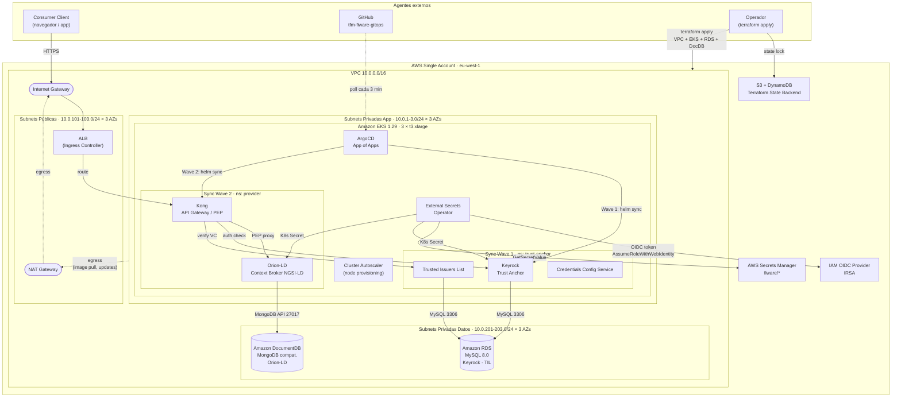
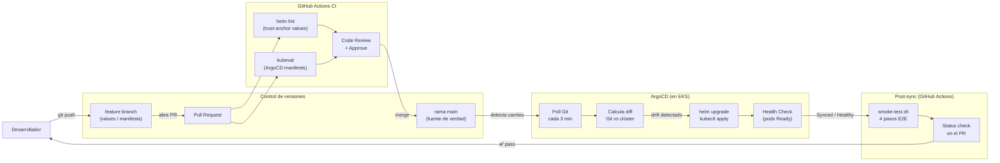
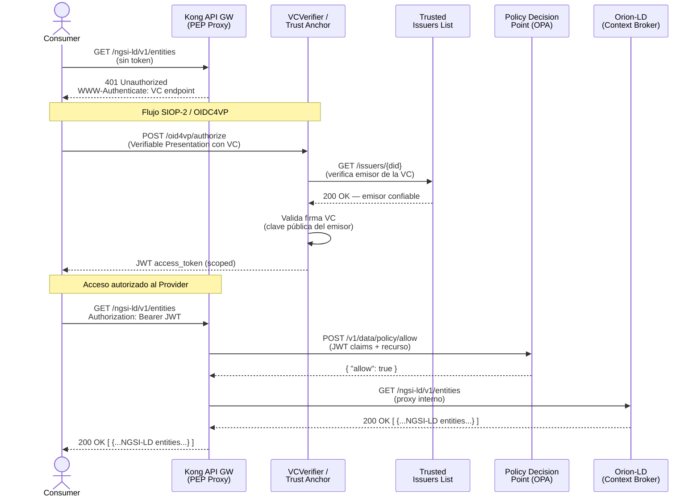
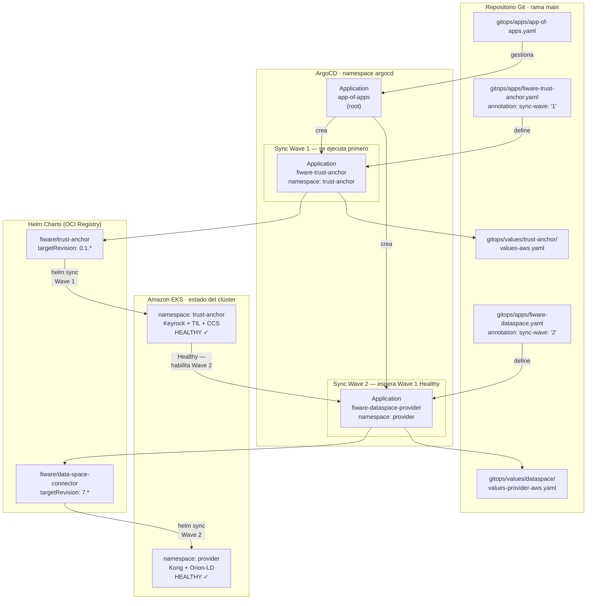
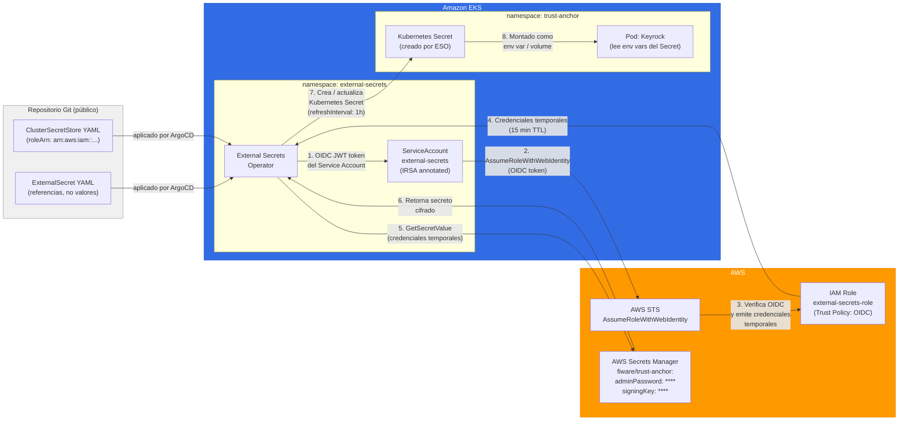
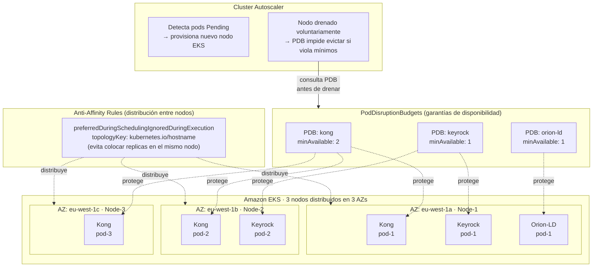

# Diagramas de Arquitectura
## TFM — Automatización GitOps de FIWARE Data Spaces con ArgoCD y Helm

Todos los diagramas están en formato **Mermaid**. Compatibles con GitHub Markdown, Obsidian, MkDocs y Pandoc (con `mermaid-filter`).

---

## Diagrama 1 — Arquitectura AWS: single account, VPC 3 capas

Muestra la infraestructura completa desplegada en AWS: tres niveles de subnets (pública, aplicación, datos), clúster EKS con los componentes FIWARE, bases de datos gestionadas (RDS MySQL para Keyrock/TIL y DocumentDB para Orion-LD), gestión de secretos mediante IRSA y estado Terraform en S3.

---

## Diagrama 2 — Flujo GitOps end-to-end

Representa el ciclo completo desde un `git push` hasta la verificación del estado del clúster, incluyendo la validación en CI y el ciclo de reconciliación de ArgoCD.

---

## Diagrama 3 — Flujo de autenticación SIOP-2 (E2E)

Diagrama de secuencia del protocolo SIOP-2 (Self-Issued OpenID Provider v2) implementado en FIWARE Data Spaces. Muestra los pasos desde la solicitud del Consumer hasta la respuesta de datos NGSI-LD del Provider.

---

## Diagrama 4 — Patrón App of Apps con Sync Waves

Muestra la jerarquía de Applications en ArgoCD y el orden de despliegue garantizado por las Sync Waves. El Trust Anchor debe estar en estado `Healthy` antes de que el Connector inicie su proceso de registro.

---

## Diagrama 5 — Gestión de secretos: IRSA + External Secrets Operator

Muestra el flujo completo de proyección de secretos desde AWS Secrets Manager hasta los pods FIWARE, sin que ninguna credencial transite por el repositorio Git.

---

## Diagrama 6 — Alta disponibilidad: PodDisruptionBudgets y Anti-Affinity

Muestra cómo se garantiza la disponibilidad del dataspace FIWARE durante fallos de nodo o actualizaciones voluntarias del clúster, mediante la combinación de PodDisruptionBudgets y reglas de Anti-Affinity entre nodos.

---

## Resumen de diagramas

| # | Diagrama | Tipo Mermaid | Sección TFM |
|---|----------|-------------|-------------|
| 1 | Arquitectura AWS completa (3 capas) | `flowchart TB` | Cap 3 §3.4 / Cap 4 §4.0 |
| 2 | Flujo GitOps end-to-end | `flowchart LR` | Cap 4 §4.4 |
| 3 | Flujo autenticación SIOP-2 | `sequenceDiagram` | Cap 4 §4.1 |
| 4 | App of Apps con Sync Waves | `flowchart TD` | Cap 4 §4.3 |
| 5 | Gestión de secretos IRSA + ESO | `flowchart LR` | Cap 4 §4.3.4 |
| 6 | Alta disponibilidad PDB + Anti-Affinity | `flowchart TB` | Cap 4 §4.5 |
