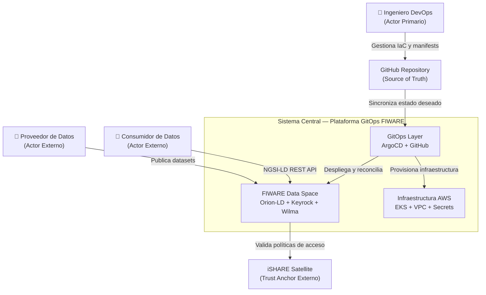
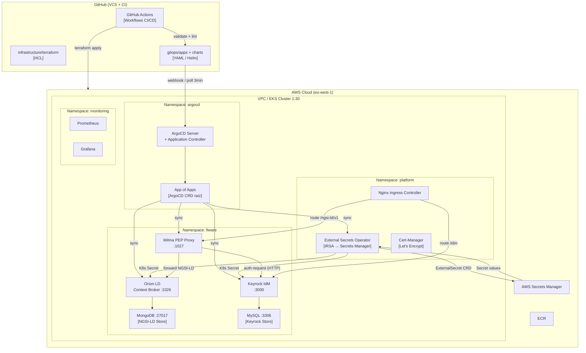
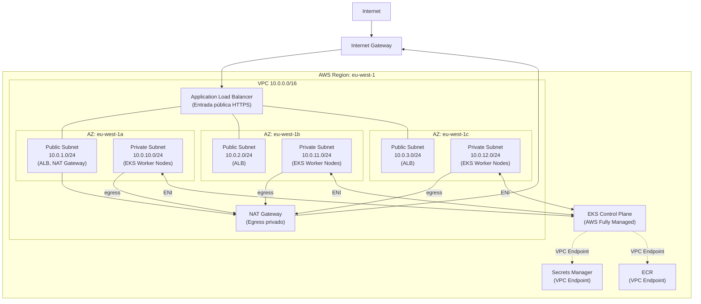
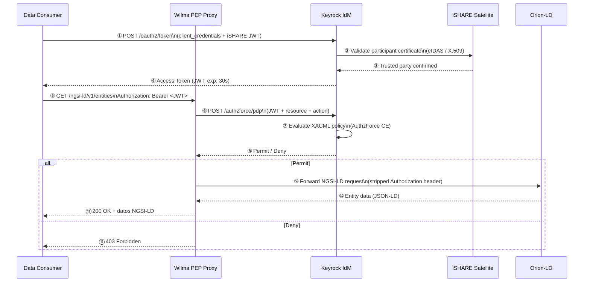
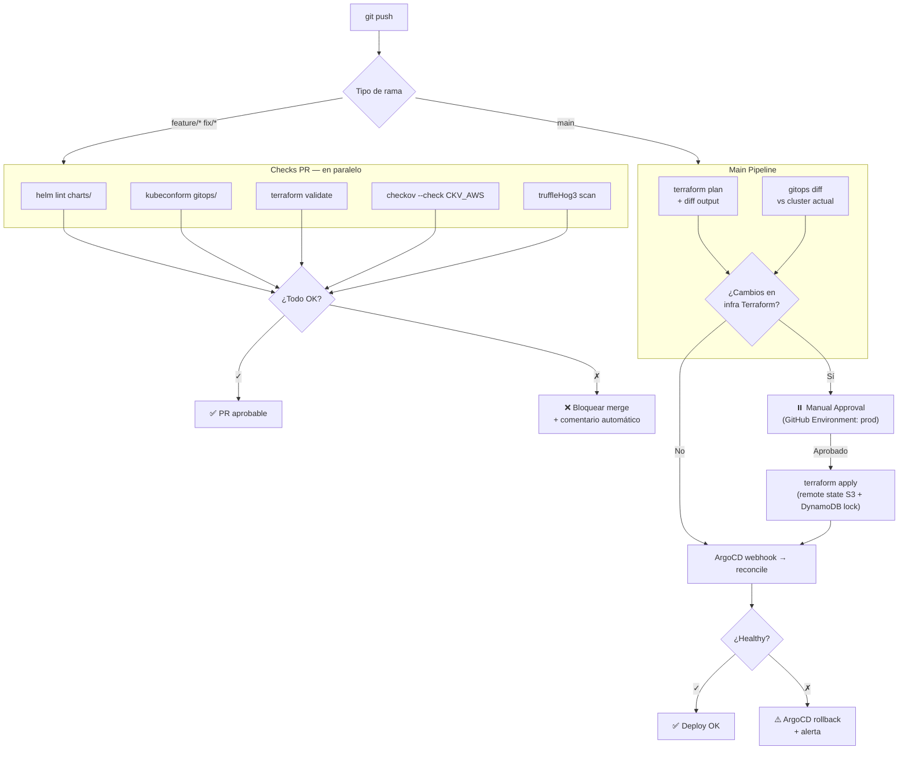
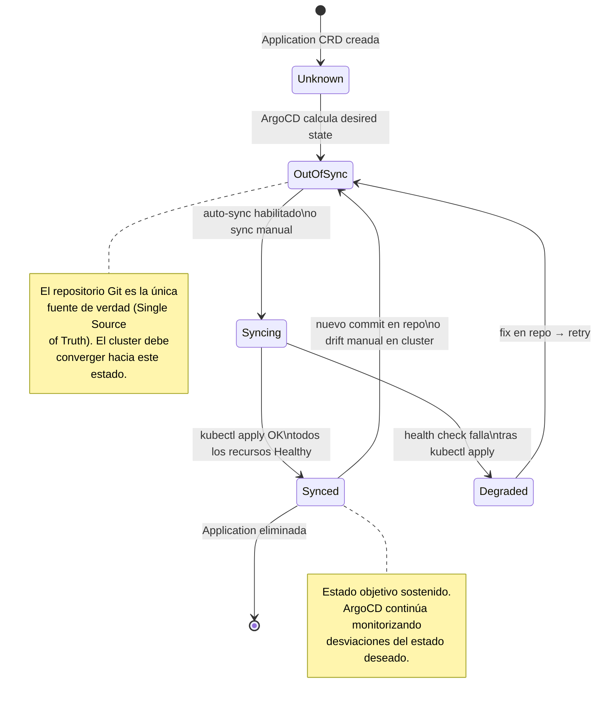
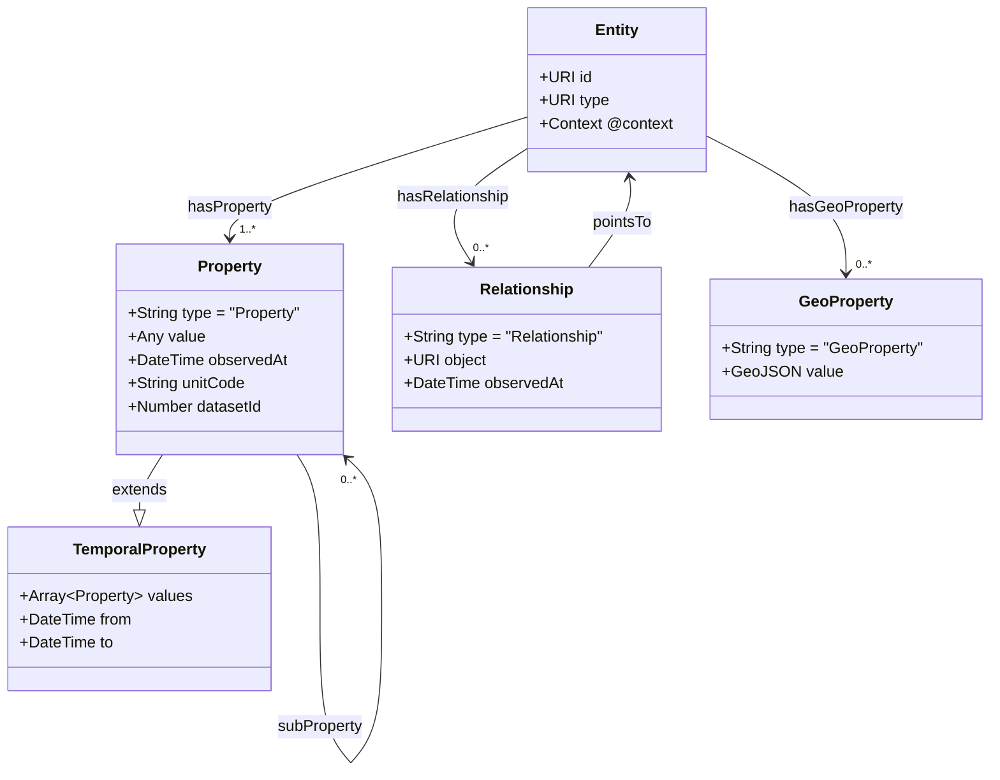

# Catálogo de Diagramas — TFM GitOps FIWARE

Todos los diagramas están en formato **Mermaid** y se renderizan automáticamente en GitHub.
Para incluirlos en la memoria LaTeX, ver la sección [Guía de Exportación](#guía-de-exportación-para-latex) al final de este documento.

---

## D1 — Arquitectura Global del Sistema (Vista Contextual C4 — Level 1)

> **Capítulo de referencia:** 4. Arquitectura y Diseño — Figura 4.1  
> **Descripción:** Identifica los actores principales, el sistema central y los sistemas externos con los que interactúa la plataforma. Corresponde al nivel más alto de abstracción del modelo C4 (Brown, 2018).



---

## D2 — Arquitectura de Contenedores (Vista C4 — Level 2)

> **Capítulo de referencia:** 4. Arquitectura y Diseño — Figura 4.2  
> **Descripción:** Desglosa el sistema central en sus contenedores software (procesos, servicios, almacenes de datos), sus tecnologías y las interfaces de comunicación entre ellos.



---

## D3 — Topología de Red AWS

> **Capítulo de referencia:** 4. Arquitectura y Diseño — Figura 4.3  
> **Descripción:** Representa la distribución de subredes en tres Zonas de Disponibilidad (AZ) dentro de la VPC, garantizando alta disponibilidad y aislamiento de red según el modelo de responsabilidad compartida de AWS.



---

## D4 — Flujo de Acceso Controlado en el Data Space (iSHARE)

> **Capítulo de referencia:** 4. Arquitectura y Diseño — Figura 4.4  
> **Descripción:** Protocolo de acceso federado siguiendo el marco de confianza iSHARE. El flujo implementa el patrón de delegación de autorización mediante JWT + XACML policy evaluation.



---

## D5 — Pipeline CI/CD

> **Capítulo de referencia:** 5. Implementación — Figura 5.1  
> **Descripción:** Flujo completo del pipeline de integración y entrega continua, con gates de seguridad y aprobación manual para cambios de infraestructura.



---

## D6 — Ciclo de Vida de Sincronización ArgoCD

> **Capítulo de referencia:** 4. Arquitectura y Diseño — Figura 4.5  
> **Descripción:** Máquina de estados que representa el ciclo de vida de una Application ArgoCD, desde su creación hasta la detección de drift y re-sincronización.



---

## D7 — Modelo de Datos NGSI-LD

> **Capítulo de referencia:** 2. Estado del Arte — Figura 2.2  
> **Descripción:** Modelo conceptual de una entidad NGSI-LD según la especificación ETSI GS CIM 009. Define la estructura de propiedades, relaciones y metadatos temporales.



---

## Guía de Exportación para LaTeX

### Opción A — Mermaid Live (Recomendada para TFM)

1. Ir a [https://mermaid.live](https://mermaid.live)
2. Pegar el bloque Mermaid del diagrama deseado
3. Seleccionar theme `neutral` (fondo blanco, adecuado para impresión académica)
4. Exportar como **SVG**
5. Convertir SVG → PDF vectorial con Inkscape:
   ```bash
   inkscape --export-type=pdf --export-filename=d1_arquitectura.pdf d1_arquitectura.svg
   ```

### Opción B — CLI mmdc

```bash
npm install -g @mermaid-js/mermaid-cli
mmdc -i d1_arquitectura.mmd -o d1_arquitectura.pdf \
     -t neutral -b white --width 1400 --height 900
```

### Opción C — draw.io (Para diagramas de mayor calidad visual)

Para D1, D2 y D3 se recomienda recrearlos en [draw.io](https://draw.io) con iconos oficiales:
- **AWS Architecture Icons:** https://aws.amazon.com/architecture/icons/
- **Kubernetes Icons:** https://github.com/kubernetes/community/tree/master/icons
- **FIWARE logos:** https://www.fiware.org/brand-guide/

### Tabla de figuras para LaTeX

| Diagrama | Archivo recomendado | Capítulo | Etiqueta LaTeX |
|---------|---------------------|---------|----------------|
| D1 — Contexto global | `d1_contexto_global.pdf` | Cap. 4 | `fig:d1-contexto` |
| D2 — Contenedores C4 | `d2_contenedores.pdf` | Cap. 4 | `fig:d2-contenedores` |
| D3 — Topología red | `d3_topologia_red.pdf` | Cap. 4 | `fig:d3-red` |
| D4 — Flujo iSHARE | `d4_flujo_ishare.pdf` | Cap. 4 | `fig:d4-ishare` |
| D5 — Pipeline CI/CD | `d5_pipeline.pdf` | Cap. 5 | `fig:d5-pipeline` |
| D6 — Estados ArgoCD | `d6_estados_argocd.pdf` | Cap. 4 | `fig:d6-argocd` |
| D7 — Modelo NGSI-LD | `d7_ngsi_ld.pdf` | Cap. 2 | `fig:d7-ngsi-ld` |

### Snippet LaTeX de referencia

```latex
\begin{figure}[htbp]
  \centering
  \includegraphics[width=0.95\textwidth]{figuras/d1_contexto_global.pdf}
  \caption{Arquitectura global del sistema — vista contextual (C4 Level 1).}
  \label{fig:d1-contexto}
\end{figure}
```
